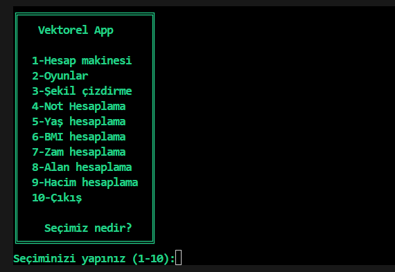
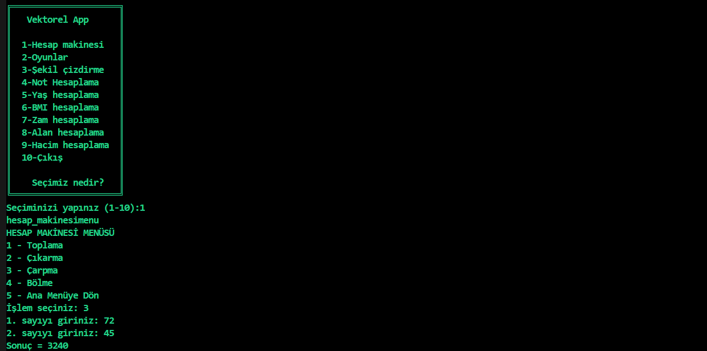
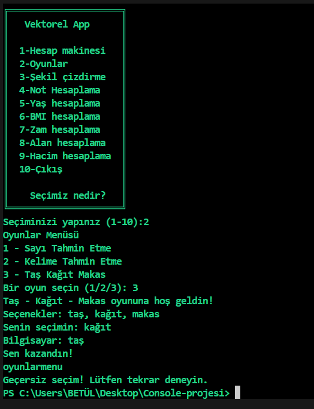
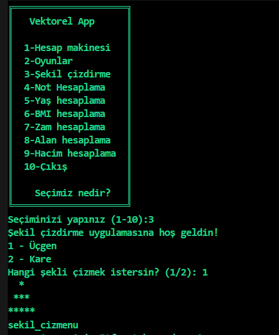
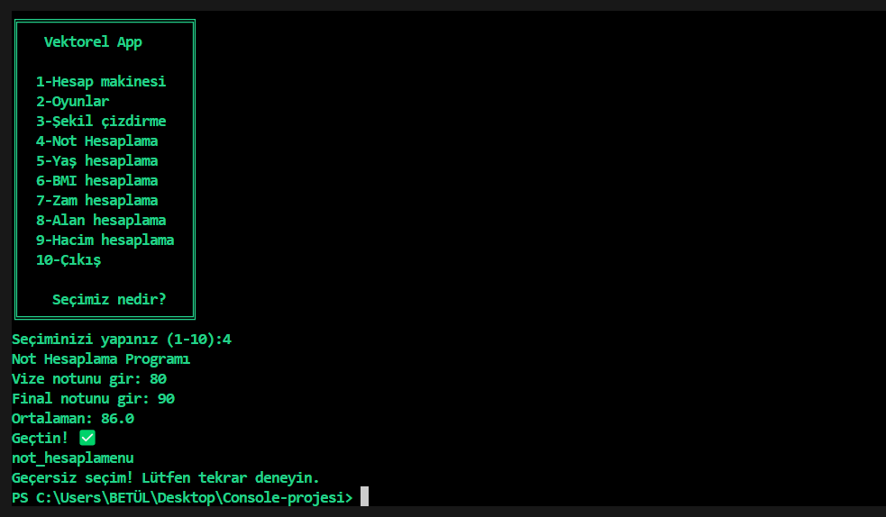
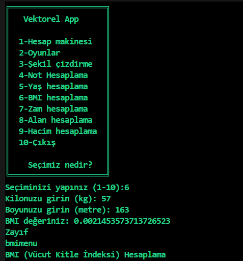
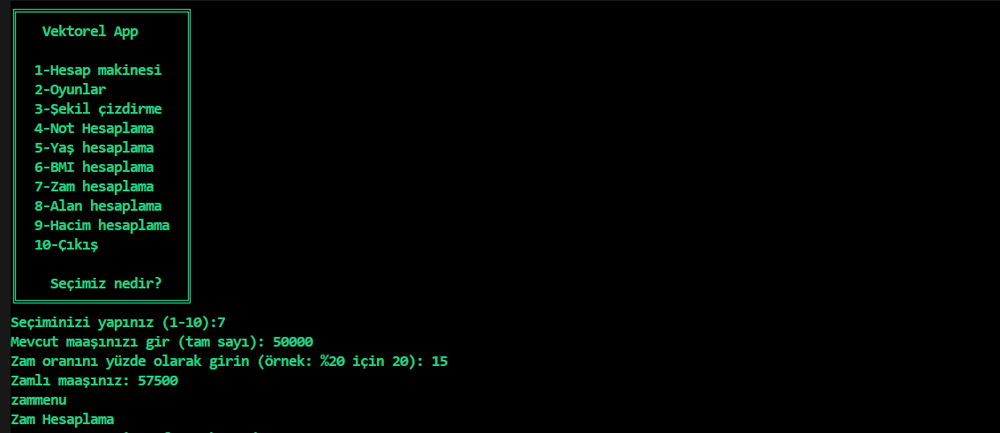
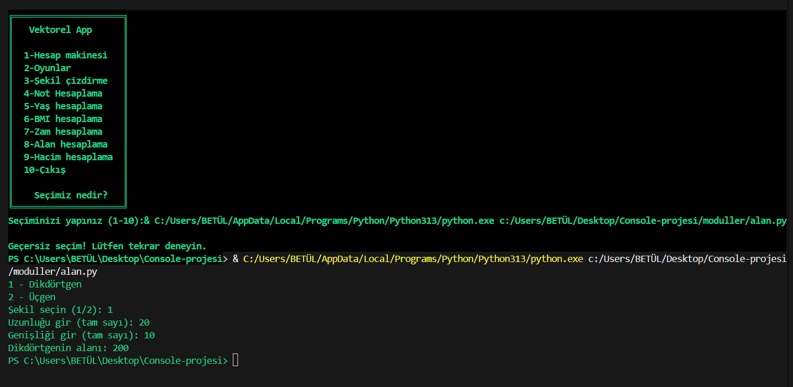
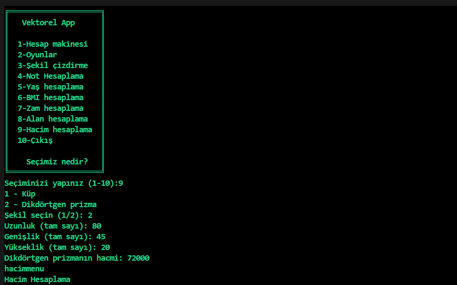

# Console-projesi
# proje-1
## ekran görüntüsü

#ANA MENÜ
-----------

********************************************
#HESAP MAKİNESİ
----------------

********************************************
#OYUNLAR
----------

********************************************
ŞEKİL ÇİZDİRME
----------------

********************************************
NOT HESAPLAMA
---------------

********************************************
YAŞ HESAPLAMA
---------------

********************************************
VÜCUT KİTLE ENDEKSİ HESAPLAMA
-------------------------------

********************************************
ZAM HESAPLAMA
---------------

********************************************
ALAN HESAPLAMA
----------------

*******************************************
HACİM HESAPLAMA
-----------------

*******************************************