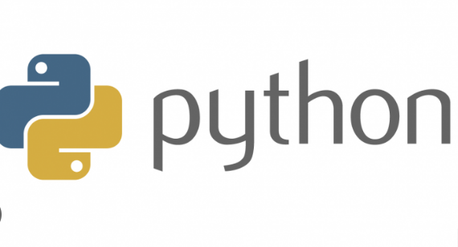

# Console-projesi
# proje-1
# PHYTON

#PROJE AÇIKLAMASI
-------------------

Bu projede 1 den 10 a kadar hesap makinesi,oyunlar,şekil çizdirme,not hesaplama,yaş hesaplama,vücut kitle endeksi hesaplama,zam,alan hacim modülleri bulunmaktadır. Bu modüllerden istediğiniz birisini seçip hesaplama yapabilir veya oyun oynayabilirsiniz.Projede kullanılan kodlar mevcuttur.Bu proje phyton da konuları daha iyi kavramak ve uygulama için yapılmıştır.

#VİDEO
--------
<a href="https://drive.google.com/file/d/1Z9sLZ9oGRjoH65gWo7FPbYg-TjNk3JJy/view?usp=sharing">
Projeyi anlatan videoya ulaşmak için tıklayınız.

</a>

#ANA MENÜ
-----------

 Burada hesaplama menüleri ve oyunlar menüleri bulunmaktadır. 1-10 arası seçim yapabilirsiniz.

-------------------------------------------

#1.HESAP MAKİNESİ
----------------

Burada toplama,çıkarma ,çarpma, bölme işlemlerinden herhangi birisini yapabilirsiniz.

------------------------------------------

#2.OYUNLAR
----------

Burada sayı tahmin etme, kelime tahmin etme ve taş kağıt makas olarak 3 adet oyunumuz var, istediğinizi seçip oynayabilirsiniz.

------------------------------------------

#3.ŞEKİL ÇİZDİRME
----------------

Burada üçgen ve kare şekillerinden istediğinizi çizdirebilirsiniz.

-------------------------------------------

#4.NOT HESAPLAMA
---------------

Burada vize ve final notunuzu girerek dersten geçip geçmeyeceğinizi öğrenebilirsiniz.

--------------------------------------------

#5.YAŞ HESAPLAMA
---------------

Burada doğum yılınızı girerek yaş hesaplayabilirsiniz.

--------------------------------------------

#6.VÜCUT KİTLE ENDEKSİ HESAPLAMA
-------------------------------

Burada boyunuzu ve kilonuzu girerek vücut kitle endeksinizi hesaplayarak zayıf,kilolu gibi kategorilerden hangisine girdiğinizi öğrenebilirsiniz.

--------------------------------------------

#7.ZAM HESAPLAMA
---------------

Burada şu anki maaşınızı ve yapılacak zam oranını girerek maaşınızın zamlı halini öğrenebilirsiniz.

--------------------------------------------

#8.ALAN HESAPLAMA
----------------

Burada dikdörtgen ve üçgenden birini seçip istediğiniz değerleri girerek alan hesaplayabilirsiniz.

--------------------------------------------

#9.HACİM HESAPLAMA
-----------------

Burada dikdörtgen prizma ve küpten birini seçip istediğiniz değerleri vererek hacim hesaplayabilirsiniz.

--------------------------------------------

#10.ÇIKIŞ
-----------------

Ana menüde 10 yazarsanız çıkış yapabilirsiniz.

--------------------------------------------
